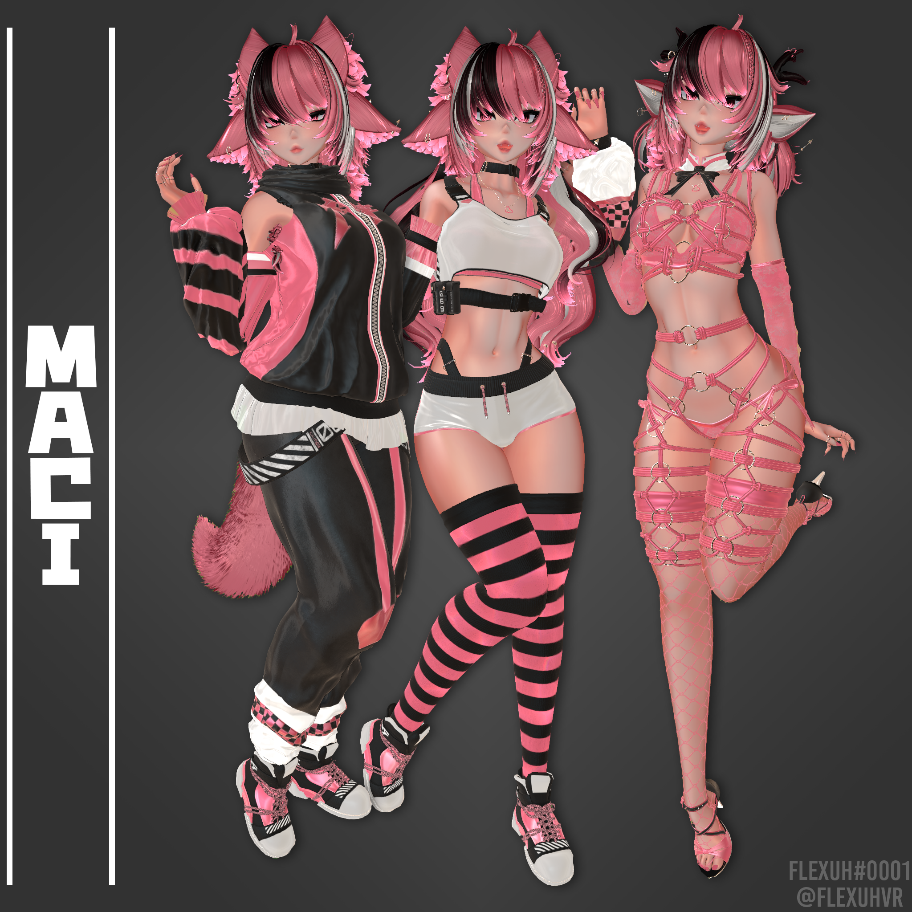

# <b>Maci</b>

## <b><u>Basics</u></b>

* Twist bones for for all major joints on the body.
* Phys Bones: boobs, butt, hair, tummy, thighs, pretty much anywhere they'd normally be and colliders all over!
* Grabbing, posing and stretching where you expect it!
* 100% PBR textured in Substance Painter. The textures have already been crunched and compressed within the project for the highest detail with the lowest file size and VRAM usage.
* This model is fully made with the metallic & specular workflow of Poiyomi shader. This models look will adjust depending on the map you're in.
* Full-body ready and tested. 
* Overflow gesture setup, combine 2 of the same gestures to exaggerate the expression! Expression can be combined with other expressions to create even more facial expressions
* Custom blinking setup! (You must remove this or create a toggle if you wish to use eye-tracking.)
* Bounding boxes has been edited so meshes do not disappear with occlusion.
* .blend file included for editing the model!
* Avatar comes with blendshapes for SRanipal/VRCFaceTracking Eyetracking, NOT FULL FACE TRACKING ONLY EYETRACKING.  It does not come set up on the avatar. You must set it up yourself.
* Reduced Clipping Distance - Get extra close and comfortable!
* Comes with a prefab for adding your own outfits! - DLC outfits to come in the future!
* SFW Prefab available.
* Good Rating Prefab available.

---

## <b><u>Condensed Parameters by dor_ - Allowing more than 256 bits for synchronized avatar customization</u></b>

---

### <b><u>This model has a UNIQUE save system in place!</u></b>

This means, you are able to create save states of the customizations you make and load them at anytime!

The outfit saves come PRE LOADED with saves that I find to be convenient but you can overwrite these with anything you want!

There are 2 separate save options available for:
* Outfit Toggles
* Outfit Colors
* Hair & Body Colors
* Misc - Shader settings, etc.
* All

The outfit saves come preloaded with 2 easy of access saves (These can be overwritten with your own options using the Save buttons):
* Load Save 1 - Loads a version of the casual outfits with no coat or pants.
* Load Save 2 - Loads the lingerie outfit.

This system was made and put in place by dor_. All credit and thanks goes to them!

---

### <b><u>Avatar Dynamics Features</u></b>

* Anti Eye-Poke System! Her eyes will close if any fingers get too close!
* Get close and personal with her for a kissy face.
* Pat her head for a happy face with heart particles.
* ASMR heartbeat audio when you get near her chest.
* All of these features can be toggled to your choosing.

### <b><u>Physbones 1.1 Compatibility! Squishy bones!</u></b>

* This model utilizes Physbones 1.1 and has a unique squishing setup on her breasts.
* Anyone can squish her breasts using their: hands, fingers, head and feet!
* You can toggle this functionality if you choose not to use it.

---

## <b><u>Toggles</u></b>

### <b>Animal Parts</b>
* "Wolf" Ears/Tail - Separate toggles for the top and bottom ear set
* Deer Antlers
* Deer Ears/Tail
* Elf Ears

### <b>Main Toggles</b>
* Choker
* Hightops
* Sleeves
* Pants
* Tanktop/Belt
* Coat/Frill
* Shorts
* Thighighs
* Sports Bra
* Panties

### <b>Lingerie Toggles</b>
* Bra
* Panties
* Heels
* Sleeves
* Shibari
* Holdable Shibari Rope-loop

### <b>Hairstyles</b>
* Long Curls
* Short
* Short/Long Pigtails

## <b><u>Appearance Edits</u></b>

### <b>Shader Edits</b>
* Emission - Increase or decrease the models overall Emission amount.
* Lighting Multiplier - Increase or decrease the models overall lighting amount.
* Fallback Reflections - Enable this in maps without a reflection probe to maintain some of the models PBR reflection settings.
* Outlines Toggle - Toggles the outlines effect on the body and face.
* Audio Link Toggle - Disable Audiolink setup.

### <b>Body Edits</b>
* Breast Scale - Increases or Decreases Size.
* Butt Scale - Increases or Decreases Size.
* Skin-tone - Darkens the skin-tone.
* Skin Shininess - Increase or decrease the shiny effect on the skin.
* Alternate Body Styles - Tattooed skin, body-writing and blank skin.
* Alternate Eye Texture

---

## <b><u>Color Edits</u></b>

You can make nearly any color combination by modifying the Hue, Saturation and Lightness to your liking. Each material group has a main and secondary color that you can modify the HSL of.

Hue modifies the overall color, lightness will make the shade of the area lighter or darker and saturation will add or subtract how much color is in the area.

### <b>Hue</b>
* Hair
* Hair Tips
* Nails/Eyes/Metallic Parts/Tattoo Accents
* Outfit 1/2/Lingerie

### <b>Saturation/Lightness</b>
* Same as all the hue sliders.

---

### <b>This model Utilizes SPS</b>

### <b><u>[Lollipop by Wholesome](https://wholesomevr.gumroad.com/l/lollipoptori)</u></b>
* Detailed penetrator with MANY options.

### <b><u>[Socket Setup by Wholesome](https://wholesomevr.gumroad.com/l/sps)</u></b>
* 6 Socket placement options with interactive expressions.

### <b><u>[PCS by Dismay](https://dismay.gumroad.com/l/penetration-contact-system)</u></b>
* Plap, plap, plap, this feature adds all kinds of audio to the avatar.

*Read the original product pages to see all features!*

---

## <b><u>Credits</u></b>

* [GOGO LOCO](https://franadavrc.gumroad.com/l/gogoloco)
* [HEAD HEART PARTICLES](https://kisustar.gumroad.com/l/HeadHearts)
* [HEAD (edited by me DO NOT REUSE.)](https://cicieaaavr.gumroad.com/l/cicis3)
* FLEXUH EDIT BODY (DO NOT REUSE)
* [BODY/FACE TEXTURES (DO NOT REUSE ANY BODY OR FACE TEXTURES. THEY * * HAVE BEEN EDITED BY ME AND ARE NOT FREE.)](https://yingyangvr.gumroad.com/)
* [TATTOO ALPHAS (PLACEMENT BY ME, LICENSE OWNED BY ME DO NOT REUSE)](https://www.artstation.com/pouriakhoshkbari/store)
* [CRYING PREFAB](https://axphy.gumroad.com/l/CryMore)
* [PIGTAILS AND CURLS HAIR](https://saikura.gumroad.com/)
* [EYE TEXTURES](https://ryuohh.gumroad.com/)
* [WOLF TAIL](https://winks.gumroad.com/)
* [DEER PARTS](https://www.vix-vr.com/)
* [HIGHTOPS](https://deimos.sellfy.store/)
* [HEELS](https://payhip.com/b/XF2SG?ref=jinxxy)
* [JEWELRY](https://sockembopem.gumroad.com/)
* [DILDO MESH](https://torinyan.gumroad.com/l/tbzvv)
* [SHIBARI](https://sezzy.gumroad.com/)

---

## <b><u>General use ToS</b></u>

* Do NOT upload this avatar for anyone but yourself.
* Do NOT upload this avatar as public.
* Do NOT resell any version of this avatar.
* Do NOT share the files of this avatar.
* Do NOT buy this avatar and reuse the assets.
* You may edit this avatar but do NOT take the assets without buying them from the original creator.
* Avatar is intended for use by 18+ Users.

## <b><u>Content Creation ToS</b></u>

* You may use this avatar for streaming, video recording, photoshoots, etc but you must ALWAYS credit me. Please link back to my Gumroad or the original product page.

---

*Want to report an issue, need assistance with uploading or any other question?  
[Join my Discord server and open a ticket to get assistance!](https://discord.flexuhvr.co)*